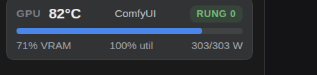
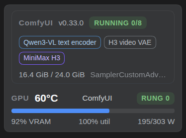

# dsh-client-ui-hawk-hq

An out-of-tree [DeepSeek Harness](https://www.npmjs.com/package/@deepseek-ai/dsh) plugin that
puts the machine into the UI: a live **GPU tracker** in the sidebar that also names what
**ComfyUI** is holding in VRAM, the running **harness version** next to it, three extra
**settings pages**, a **prompt-template dropdown** in the composer, and **Hawk Radio** — a
radio station that writes its own songs with a text model and renders them with a music model.

Seven surfaces, one host half:

| # | Surface | Registered as | Survives `npm i -g` |
|---|---|---|---|
| 1 | Sidebar foot **GPU mini panel** + **ComfyUI panel** | `sidebar.footer.action` (id `hawk-gpu-sidebar`) | yes |
| 2 | **DSH version badge** | `sidebar.version` (id `hawk-dsh-version`) | **needs the seat patch** — see below |
| 3 | Settings → **GPU Watchdog** | `settings.section` (id `hawk-gpu-watchdog`) | yes |
| 4 | Settings → **Notifications** | `settings.section` (id `hawk-notifications`) | yes |
| 5 | Settings → **HQ Dashboard** | `settings.section` (id `hawk-dashboard`) | yes |
| 6 | Composer **⚡ Skills…** | `conversation.input.left` (id `hawk-composer-skills`) | yes |
| 7 | Sidebar **Hawk Radio** card + modal | `sidebar.footer.action` (same occupant as #1) | yes |

Plus two shell CSS overrides (user speech bubbles span the full chat width, and the
sidebar-head spacing is tightened) — see "Fragile by nature" below.



*Sidebar foot: junction temperature, the workload holding the card, the guardian rung, VRAM / utilisation / board power.*



*Sidebar foot while ComfyUI is loaded: engine version, queue state, one chip per resident model, the card's VRAM as ComfyUI sees it, and the node doing the work — stacked above the GPU panel in the same seat occupant.*


*Composer ⚡ Skills… — pick a template, its text lands in the draft.*

## Host routes

Everything is served under `/plugin/hawk-hq`. No route calls a paid API; every byte comes
from `rocm-smi`, `/proc`, ComfyUI on localhost, a local log/JSONL/SQLite file, or the public
npm registry.

| Route | Source | Notes |
|---|---|---|
| `GET /plugin/hawk-hq/gpu` | one `rocm-smi --json` sample + guardian log tail + ComfyUI state | sample cached 2 s |
| `GET /plugin/hawk-hq/gpu/events` | the same payload as SSE | one state event / 5 s |
| `GET /plugin/hawk-hq/notifications` | tail of the notifications JSONL | last 200 rows |
| `GET /plugin/hawk-hq/notifications/events` | SSE, live appends | |
| `GET /plugin/hawk-hq/stats` | the stats SQLite DB, read-only through `python3` | balances, quotas, 14-day tokens, 30-day spend/top-ups |
| `GET /plugin/hawk-hq/version` | the running harness version + the newest published | 30 min cache, stale-while-revalidate |
| `GET /plugin/hawk-hq/radio` | host half of Hawk Radio (below) | health, tracks, **starred**, stats, settings |

## The GPU panel, in detail

- **Sample**: `rocm-smi --showtemp --showmeminfo vram --showuse --showpower --showmaxpower --json`,
  cached for 2 s (the card polls are not free, and the panel is fed by an SSE stream).
- **Who owns the card**: a `/proc` scan, priority-ordered `llama-server|llama-cli|llama-mtmd`
  (reporting the `--model` file name) → `ComfyUI` → `vLLM` → `Ollama`. Cached 3 s; no match
  means no label rather than a guess.
- **Heat tone** follows the guardian ladder: amber at ≥85 °C, red at ≥95 °C.
- **Collapsed rail** (56 px): a single heat dot; the numbers live in its tooltip.
- **AMD only.** It shells out to `rocm-smi`; on a machine without it the panel shows the
  error string, and the rest of the plugin is unaffected.

The **GPU Watchdog** page shows the same live sample plus the tail of a guardian log: the
last 50 non-empty lines, with the highest `rung=<n>` found. A missing log is reported as
`unavailable` — never as an empty-but-healthy card.

## The ComfyUI panel, in detail

The same seat occupant renders a second block **above** the GPU readout, from the `comfy`
field of the very same `/gpu` payload (no second request, no second SSE stream):

```ts
interface ComfyStatePayload {
  up: boolean                 // ComfyUI answered on its HTTP port
  version: string | null      // comfyui_version from /system_stats
  models: ComfyModel[]        // resident in VRAM right now, oldest first
  running: boolean            // /queue has a running prompt
  pending: number             // prompts queued behind it
  progress: string | null     // sampling progress of the running prompt, e.g. "4/8"
  workflow: string[]          // node classes, the job-defining one first
  vramUsedB: number | null    // the DISCRETE card, as ComfyUI sees it
  vramTotalB: number | null
  error?: string              // set when the read failed while ComfyUI was expected
}
```

- **Rendered only when it has something to say**: `up && (running || models.length > 0)`.
  ComfyUI down, or up and idle, renders nothing — no empty card, no permanent furniture.
- **Model names come from ComfyUI's own log.** It exposes no "what is loaded" endpoint, so
  the host half tails the newest `comfyui*.log` in `comfyLogDir` for
  `Requested to load <class>` lines and maps loader classes to friendly names and kinds
  (`MiniMaxH3TEModel` → *Qwen3-VL text encoder*, kind `text`; `MiniMaxH3VideoVAE` → *H3
  video VAE*, kind `vae`; `MiniMaxH3` → *MiniMax H3*, kind `video`). Unmapped classes keep
  their own name rather than being guessed at.
- **A stale log line can never claim a resident model**: the list is emptied unless the card
  actually holds more than 1 GB.
- **The discrete card wins.** ComfyUI lists every device it can see; an integrated GPU's
  shared pool can report a larger total than the discrete card (measured: 33.5 GB iGPU vs
  25.8 GB dGPU), so integrated parts (`Radeon Graphics`, `UHD`, `Iris`, `Vega N`) are
  filtered out by name before the largest pool is taken.
- **`workflow[0]` is the job, not the loader**: sampler / image-to-video classes sort first,
  so the line reads `SamplerCustomAdvanced` rather than `UnetLoaderGGUF`. The full node list
  is in the tooltip.
- ComfyUI is optional. With nothing listening, `up: false` plus an `error` string comes back
  and the block simply does not render; the GPU panel beside it is untouched.

## Configuration

```ts
interface HawkHqConfig {
  guardianLog?: string        // default: $HOME/dsh-hq/logs/gpu-guardian.log
  notificationsFile?: string  // default: $HOME/.dsh/notifications.jsonl
  statsDb?: string            // default: $HOME/dsh-hq/stats.db
  comfyUrl?: string           // default: http://127.0.0.1:8188
  comfyLogDir?: string        // default: $HOME/comfyui/logs
}
```

Every path is optional and every reader degrades: a missing log or JSONL renders as empty /
`unavailable`, a missing stats DB surfaces as a **one-line** error on the Dashboard card (e.g.
`sqlite3.OperationalError: unable to open database file`), a missing ComfyUI log directory or
an unreachable ComfyUI hides the ComfyUI block, and the untruncated error text goes
to the harness log. The error body is deliberately short — the host half never returns a
command dump to the browser. Nothing is ever invented to fill a card.

## Install

```bash
pnpm install
pnpm build                       # tsdown → lib/index.js + lib/client.js  ← REQUIRED, see below
dsh plugin --profile web add link:$PWD
# then, once per harness install/upgrade:
scripts/apply-dsh-ui-fixes.sh
```

> **Why `pnpm build` is required here:** this published repository tracks **source only** — `lib/`
> is gitignored, deliberately. `package.json` points `exports` at `./lib/index.js` and the harness
> loads that file, so a clone with no build step cannot load the plugin. (Our private working copy
> tracks `lib/` so a running rig never depends on a build; the public mirror trades that for clean
> diffs and no committed build output.) `tsdown` cleans `lib/` at the start of every build, so a
> failed build leaves it absent — re-run `pnpm build` after fixing the error, and if a working copy
> ever loses it, `git checkout -- lib` restores the committed copy.

The package declares `dsh.bundle.patch: ./cordis.patch.yml`, so adding it appends the bundle
to the profile's layer stack and the row mounts on the next harness boot. Use a **hard
reload** in the browser: client bundles are served from disk with `no-cache`, and a plain
reload can still render the previous build.

## The sidebar seat — and why there is a patch

Upstream's sidebar shell declares `sidebar.brand.mark`, `sidebar.brand.name`,
`sidebar.workspaces`, `sidebar.settings` and `sidebar.footer.action`, and owns the **New
Session** button itself. There is **no seat** between the brand row and that button, and no
way for an out-of-tree plugin to add one. So `scripts/patch_sidebar_seat.py` adds exactly
two things to the installed `@deepseek-ai/dsh-client-ui-sidebar/lib/client.js`:

1. the `sidebar.version` declaration, and
2. one row rendered between the brand row and New Session that fills it.

The occupant (this plugin) stays out of tree. The patch:

- is **idempotent** — exits 0 when the seat is already there;
- **fails loudly** when an upstream anchor moved, so an upgrade can never be silently
  half-patched;
- **verifies** — `node --check` must parse the patched file before it is swapped in, and the
  previous file is restored if it does not;
- keeps a pristine copy at `client.js.bak-pre-version-seat` and reverts with `--revert`;
- takes an explicit bundle path, or resolves the bundle of the `dsh` on `PATH`:

```bash
scripts/patch_sidebar_seat.py                      # the install dsh points at
scripts/patch_sidebar_seat.py /path/to/client.js   # or an explicit bundle
scripts/patch_sidebar_seat.py --revert
```

> **It edits a third-party bundle inside your harness install. Read it before you run it.**
> If you would rather not patch anything upstream, skip it: the badge's row simply does not
> exist, so the badge cannot render — it disappears instead of lying. The other five surfaces
> are unaffected.

`scripts/apply-dsh-ui-fixes.sh` wraps the whole recovery in one command: resolve the install
`dsh` points at, bake its version into `src/client/dsh-build.ts`, re-apply the seat patch,
rebuild, and report what the server actually serves.

## The version badge

| Situation | Rendered |
|---|---|
| Running version is the newest published | the version, **green** |
| A newer version is published | `0.1.5-rc.1 → v0.1.5-rc.2`, the newer number **bold red** |
| Check pending, failed, or no registry answer | neutral grey + the reason in the tooltip — **never green** |

It prefers the host route (`/plugin/hawk-hq/version`), and when that is not live yet (the
route appears on the next harness boot after an upgrade) the browser reads the npm registry
directly — the registry serves CORS `*`, so the badge works without a restart. The tooltip
carries the install path, every published dist-tag, when the check ran, which source
answered, and the reapply command. In the collapsed 56 px rail the badge hides itself (the
rail carries icons only).

## HQ Dashboard

One card per provider (balance, token volume, last update), plus two hand-rolled SVG charts:
14-day token volume and a 30-day spend/top-up series. The spend series sums balance **drops**
between consecutive samples as spend and **rises** as top-ups — a plain first→last delta
would read a top-up day as negative spend. A single 10-minute step above **$200** is treated
as bad data and *counted* (`ignoredSamples`) rather than hidden, after a unit bug once wrote
−$1000 samples that would otherwise have drawn a fake $1000 bar.

**The collector that fills that database is not part of this repo.** Without it the page
shows an error card. See the schema in the [root README](../../README.md#stats-db-schema-hq-dashboard).

## Fragile by nature (and how we keep it honest)

| Override | Why it exists | Why it is fragile |
|---|---|---|
| user speech bubbles span the full chat width | upstream caps the user turn at `min(chat-width * .702, 82%)` | it targets a **CSS-module class hash** (`Sixlwa_` today, `gdEzaW_` before 0.1.5) because upstream hard-codes the value with no stable hook. It also sets the variable hook `--dsh-chat-user-width: 100%` where upstream offers one |
| sidebar-head spacing | the expanded brand row is 60 px with dead space under it | same class-hash problem (`hHd-Xa_logoRow`) |
| `!important` everywhere | the stylesheet is injected **before** the shell injects its own module CSS, so at equal specificity the shell always wins | deliberate, not laziness |

Every one of these is checked by `procedures/verify.sh` against the **served** bundle, so a
rename upstream fails loudly in a check instead of quietly in the UI.

## Layout

```
src/index.ts            host half: routes, rocm-smi//proc/stat reads, ComfyUI reads, version check
src/wire.ts             host↔browser contract (type-only)
src/semver.ts           dependency-free version comparison, shared by both halves
src/client/index.ts     slot registrations
src/client/sidebar.ts   sidebar GPU mini panel      (sidebar.footer.action)
src/client/comfy.ts     ComfyUI block, stacked above that panel (same occupant)
src/client/version.ts   version badge               (sidebar.version)
src/client/dashboard.ts HQ Dashboard                (settings.section)
src/client/gpu.ts       GPU Watchdog page           (settings.section)
src/client/notifications.ts notification inbox      (settings.section)
src/client/skills.ts    composer ⚡ Skills…          (conversation.input.left)
src/client/css.ts       shell CSS overrides
src/client/dsh-build.ts GENERATED — harness version at build time
scripts/                seat patch + the after-upgrade wrapper
```

## Development

```bash
pnpm build       # tsdown
pnpm typecheck   # tsc -p tsconfig.json
pnpm test        # node test/semver.test.mjs — imports the TypeScript source directly,
                 # which needs Node's built-in type stripping (22.6+ flagged, on by default from 23.6)
```

## Hawk Radio (2026-09-16) — a radio that plays songs which do not exist yet

A compact card in the sidebar above the GPU cards, with the detail in a modal
behind its gear button. Press play and it goes live: a **planner** (a text LLM)
writes a song's caption, lyrics and metadata, a **music model** (ACE-Step) renders it, and the
next song starts being written the moment the current one starts playing — exactly one song
ahead, never more.

### Two model pickers, never one list

| Picker | What it is | Where the list comes from |
|---|---|---|
| **Planner** | the text model that writes the caption, lyrics, BPM/key and title | the harness's own model catalogue (`~/.dsh/settings.yaml` in both of its shapes, plus the active profile patch) — so **any model the user has configured in DSH appears here**, and a cloud model (DeepSeek) is the resolved default |
| **Music** | the renderer that turns the planner's song into audio | the renderer itself: `/v1/models` unioned with `/health`'s `loaded_model` (that list endpoint answers empty until the DiT is initialised through it, which is why both are read) |

They are deliberately separate: a music model cannot write words, and an LLM
cannot make sound.

### Two folders, one pipeline (star means reserve)

The star on a song is **not** a rating — it is a **reservation**. Starring a song that is
playing copies it out of the live pipeline into a second folder, and the live copy is swept
when the song ends:

| Folder | Config key | What reads it |
|---|---|---|
| **live** — what the radio rotates, plays and deletes | `library` (default `~/.local/share/hawk-radio/library`) | the rotation, the "N ready" count, the sweep, `/radio/audio/<id>` |
| **reserved** — what the owner kept | `starred` (default: the sibling `starred/` folder, created on demand) | the modal's **Starred** list, per-row sharing |

- `POST /radio/reserve {id}` copies mp3 + sidecar into `starred/`, keeping the full metadata
  (title, station, seconds, bpm, key, lang, seed, caption, lyrics, created, share link) and marks
  the **live** copy so the rotation drops it immediately — the song that is playing keeps playing
  to its end.
- The sweep runs when the next song starts and when the radio goes off air: every song the radio
  wrote is deleted **except the ids in `keep`** (normally the one now playing). There is no rating
  exemption — the reserved copy is the survivor, so nothing of value is lost by sweeping.
- `POST /radio/unstar {id}` deletes the reserved copy. It is deliberately not a move back into
  live: a song that came back would be a song the radio never played.
- Because a reserved song is absent from the live folder, `/radio/audio/<id>` searches
  `[starred, library]` and the share/revoke routes resolve whichever folder holds the song. The
  reserved copy is therefore still playable and shareable after its live copy is gone.
- Rotation is **newest-first, never wrapping**: songs the session has already played do not come
  back, and `never` marks a hard negative.

### Silence without stopping

A phone call should not cost airtime. The mute switch (sidebar, and a chip in the modal) sets
`audio.muted` and nothing else: the position keeps moving, the song ends on time, the next song is
still written one ahead and the advance still happens. A *pause* would be going off air, and the
sweep would take the song with it. The state lives in `localStorage`, so it survives a refresh.

### Configuration — no machine specifics in the code

Everything machine-specific lives in a config file **outside this repository**
(`~/.config/hawk-radio/config.json`, written 0600), or in environment variables:

| Key | Env override | Meaning |
|---|---|---|
| `library` | `HAWK_RADIO_LIBRARY` | the **live** folder (default `~/.local/share/hawk-radio/library`) |
| `starred` | `HAWK_RADIO_STARRED` | the **reserved** folder (default: `starred/` beside `library`) |
| `aceBase` | `HAWK_RADIO_ACE_BASE` | the renderer's base URL — defaults to `http://127.0.0.1:8001`, point it wherever ACE-Step runs |
| `aceKey` | `HAWK_RADIO_ACE_KEY` | its API key, if it wants one |
| `duration` | `HAWK_RADIO_DURATION` | seconds per generated song (10–600) |
| `durationMin` / `durationMax` | `HAWK_RADIO_DURATION_MIN` / `_MAX` | a global song-length band (`0`/`0` = each station's own band) |
| `planner` | `HAWK_RADIO_PLANNER` | selected planner, `provider:model` |
| `musicModel` | `HAWK_RADIO_MUSIC_MODEL` | selected renderer model id |
| `shareBase` | `HAWK_RADIO_SHARE_BASE` | optional LAN share service; empty disables the Share action |
| `shareSecret` | `HAWK_RADIO_SHARE_SECRET` | that service's shared secret — never in this repo |

The planner call goes through **the harness's own LLM service**, not a direct
provider dial: provider keys live in the harness's sealed credential store and
base URLs belong to the provider plugins, so asking the harness means the radio
can use any model you have configured — and no keys are duplicated into a plugin.

### Host routes

| Route | Does |
|---|---|
| `GET /plugin/hawk-hq/radio` | the payload: health, `tracks` (live), `starred`, stats, stations, current selections |
| `GET /plugin/hawk-hq/radio/models` | the two model lists |
| `POST /plugin/hawk-hq/radio/reserve` | `{id}` — star: copy into the reserved folder, drop it from rotation |
| `POST /plugin/hawk-hq/radio/unstar` | `{id}` — delete the reserved copy |
| `POST /plugin/hawk-hq/radio/rate` | `never` (a hard negative) or `played`; `stars` is legacy and no longer used by the UI |
| `POST /plugin/hawk-hq/radio/prune` | `{keep:[ids]}` — sweep the live folder, keeping those ids |
| `POST /plugin/hawk-hq/radio/generate` | write one song — the only place a render starts |
| `POST /plugin/hawk-hq/radio/settings` | persist the planner / music-model / length choice |
| `POST /plugin/hawk-hq/radio/share` · `/revoke` | mint or kill a link through the optional share service |
| `GET /plugin/hawk-hq/radio/audio/<id>` | the mp3 from the **reserved folder first, then live**, with byte-range support so playback can be scrubbed |

### The songs are files, and the sidecar is the record

A song is `‹id›.mp3` plus a `‹id›.json` sidecar (title, station, seconds, bpm, key, lang, seed,
caption, lyrics, stars, never, plays, share link). The sidecar is optional for playback — an mp3
dropped in by hand still plays — and the measured tempo/key is the single source of that truth, so
a caption never asserts a contradicting number. Nothing outside the two folders is read.

### Requirements for a fork

- a **renderer** speaking the ACE-Step API (`/health`, `/v1/models`,
  `/release_task`, `/query_result`, `/v1/audio`) — any host, the config points at it
- a **planner** model configured in DSH (optional: without one, each station falls
  back to its built-in caption/title pools and keeps working)
- nothing else: no Spotify, no cloud account, no paid tier is required by this
  plugin. The Spotify-taste half of the original project is a separate concern and
  can be forked in or out freely.

### v1 scope: the radio GENERATES, it does not replay (owner, 2026-09-17)

A product decision, not a technical one:

> *"Play button … should take the radio online and generate new songs. For the recorded
> songs we need another play button and it is not radio, it is like spotify now and beats
> our purpose … We shouldn't go in there at version 1."*

- **Play = on air.** Pressing play writes a new song (planner → renderer, on demand, never on a
  timer) and plays it; the next one is written the moment the current one starts, so exactly one
  song is ever ahead.
- **Only radio-written songs are in rotation** (`radio: true` in the sidecar). Anything that
  arrived another way — imported, copied in by hand — is library material: it is kept and counted,
  and it is deliberately *not* programming. Replaying it here would turn this into a music player,
  which is a different product with its own feature set (browsing, playlists, managing hundreds of
  songs) and is shelved as **v2** on the roadmap.
- **`write 10 ahead`** is the only explicit bulk render button.
- **The rail is information only** — the station, the song's name, where we are in the song.
  Station, length, model pickers and the Starred list live in the modal, so the sidebar card stays
  small enough to sit above the GPU cards permanently.
- **Live songs are disposable by design; reserved songs are the asset.** A month of listening does
  not become a thousand files: unstarred songs leave the live folder as the radio moves past them,
  and what you starred is what you keep — the seed, caption and lyrics with it.

## License

MIT
